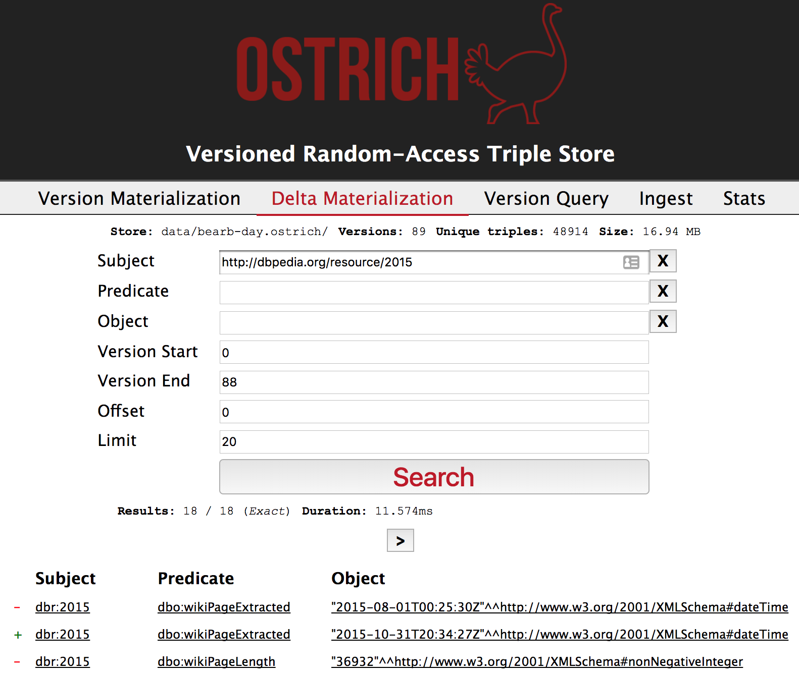
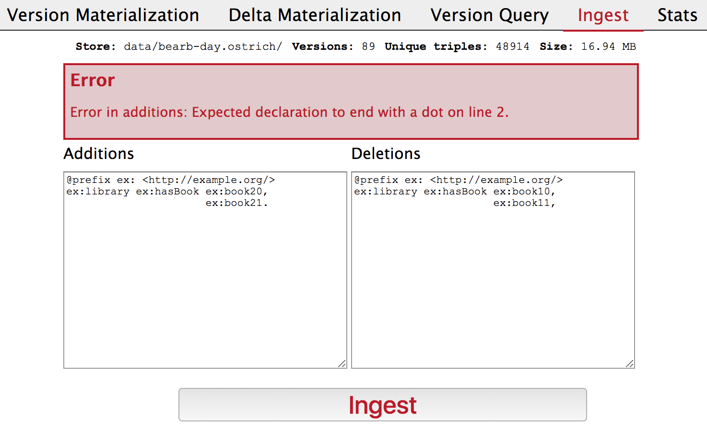
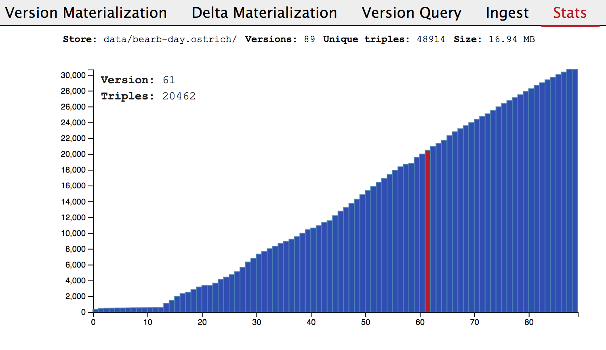

## Demonstration Overview
{:#demonstration-overview}

The goal of this demonstration is to show the capabilities of OSTRICH.
This is done using a Web application (_OSTRICH Admin_) in which an OSTRICH store can be created, viewed and updated.
When starting the application, the path to a --possibly empty-- OSTRICH store must be provided.
This application has several features, including the ability to perform VM, DM and VQ queries,
ingest new versions, and retrieve statistics about the store.
These features will be elaborated on in the next sections.
Finally, we introduce two example datasets that can be used to discover the interface.

OSTRICH Admin is implemented as a Node.js Web application using the [Express framework](https://expressjs.com/){:.mandatory}.
This was done using the OSTRICH JavaScript bindings for Node.js.
This application is available on [GitHub](https://github.com/rdfostrich/ostrich-admin){:.mandatory} under an open license.
A screencast demonstrating the usage of this application can be found on [Vimeo](https://vimeo.com/246792247){:.mandatory}.

### Query

OSTRICH Admin supports visual VM, DM and VQ triple pattern queries.
These are usable by respectively following the _Version Materialization_, _Delta Materialization_
or _Version Query_ links as can be seen in .
These pages show a form that corresponds to the OSTRICH API for these query types.

For instance,  shows the form for DM queries.
The subject, predicate and object fields are used to provide URIs, literals or variables for the triple pattern query.
A start and end version can be selected, which will define the versions over which the delta will be retrieved.
Additionally, offset and limit value can be applied to the triple results.

Below the form, the triples matching the defined query are shown.
In the case of DM queries, triples are annotated with a "+" or "-",
which indicates if they are an addition or deletion with respect to the given changeset.
Furthermore, the number of results on this page is shown, together with the total count of this query, independent of the limit and offset.
This total count can either be an exact value, or an estimate if calculating the exact value would take too much time.
Finally, the query execution time is shown.

<figure id="demo-query">

<figcaption markdown="block">
Delta Materialization interface for querying the differences between
two versions by triple pattern with a certain offset and limit.
The page shows all matching triples annotated with either the addition (+) or deletion symbol (-).
Additionally, the total number of results and the query duration time is shown.
</figcaption>
</figure>

Similar pages exist for VM and VQ queries.
For VM queries, the form does not have a version range, but only a single version field.
Furthermore, the triple results are not annotated with "+" or "-".
For VQ queries, the form has no version fields, but results are annotated with version ranges.

### Ingest

As ingesting new versions is an important feature in any archiving solution,
OSTRICH Admin allows changeset-based version ingestion as can be seen in .

This form has a textbox for additions and deletions.
This corresponds to the way the OSTRICH API accepts version ingestion,
which is done using a stream containing additions and deletions.
These textboxes accept triples in the Turtle serialization.
If the user submits the form with a syntax error, an error will be promted to the user,
explaining the error that should be corrected before ingestion can take place as shown in .

When ingestion is successful the number of inserted triples will be displayed,
together with the time it took to insert them.

<figure id="demo-ingest">

<figcaption markdown="block">
Ingesting a new version is done using a changeset form for additions and deletions.
The form accepts triples in turtle format, and will give user feedback in case invalid triples were provided.
</figcaption>
</figure>

### Statistics

Finally, OSTRICH Admin allows basic statistics about the current OSTRICH store to be displayed as shown in .

On the top of this page --and all other pages as well-- the path to the currently opened store is shown.
Next to that, the total number of versions in this store is displayed.
Finally, the total number of unique triples in this store, and the total size of this store is shown.

Additionally, this page shows a graph containing the number of triples in each version of the dataset.
This graph is interactive, and allows the user to hover over each version bar to show the exact number of triples in the selected version.

<figure id="demo-stats">

<figcaption markdown="block">
The stats page shows an overview of the number of triples in each version.
The user can hover over the version bars to see the exact number of triples in the top-left side of the graph.
</figcaption>
</figure>

### Example Datasets

For our demonstration, we provide two example datasets that can be used to load into OSTRICH admin.
All of these examples are [publicly available](https://linkedsoftwaredependencies.org/raw/ostrich/datasets/){.mandatory}.

#### Library

The first dataset is a very small synthetic dataset about the availability of books in a library.
The goal of this dataset is to explain the concept of changesets using books that are only available at specific moments in the library.
In order to make it easily understandable, this dataset has only four versions, and 11 books that are available in specific versions of the dataset.

#### DBpedia Live

A larger real-world dataset based on [DBpedia Live](cite:cites dbpedialive) contains more than 48K unique triples over 89 versions.
This dataset has been derived from the [BEAR RDF archiving benchmark](cite:cites bear).
It contains 100 most volatile resources from DB­pedia Live over the course of three months with an hourly granularity.
